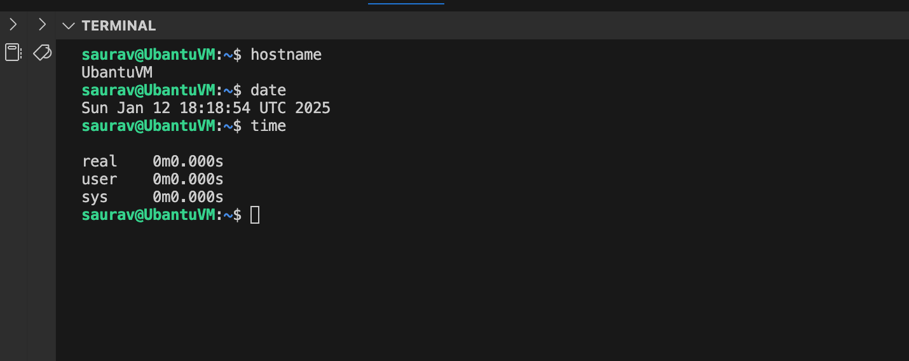
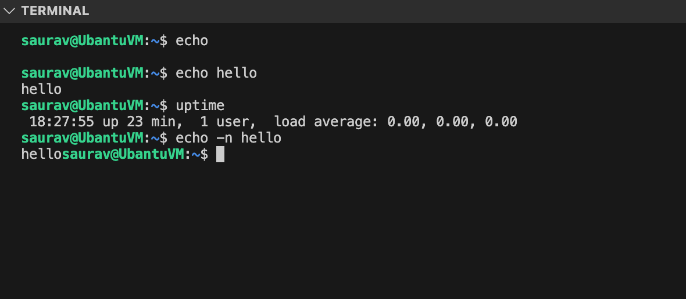
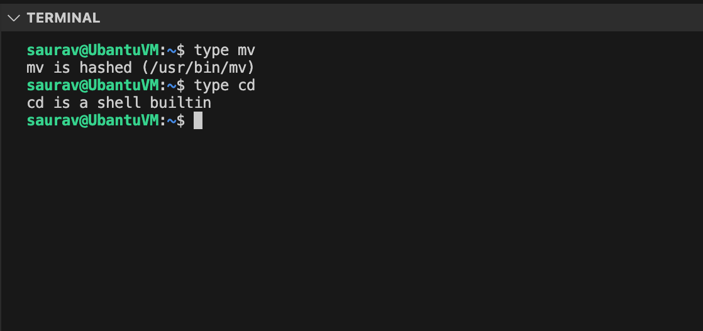
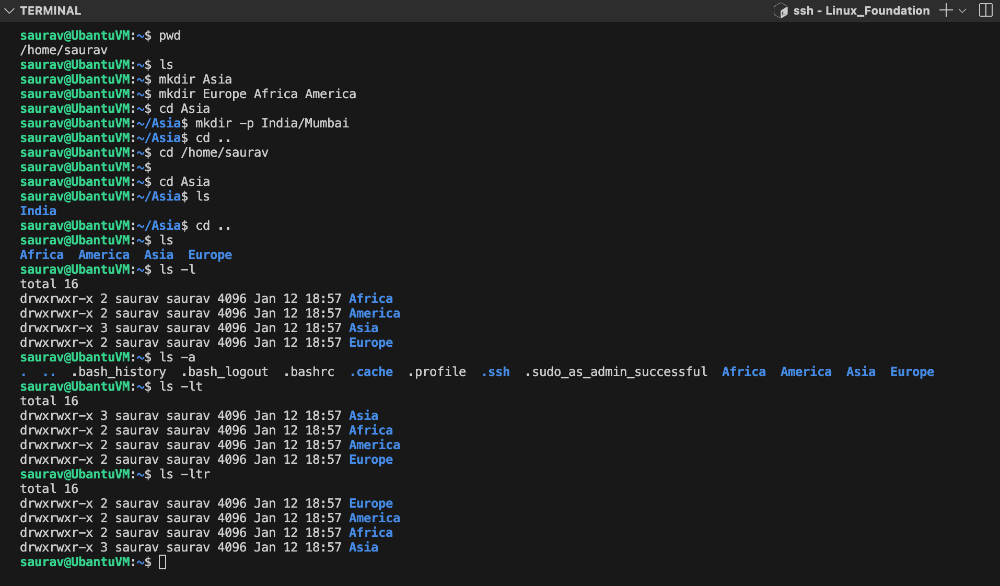
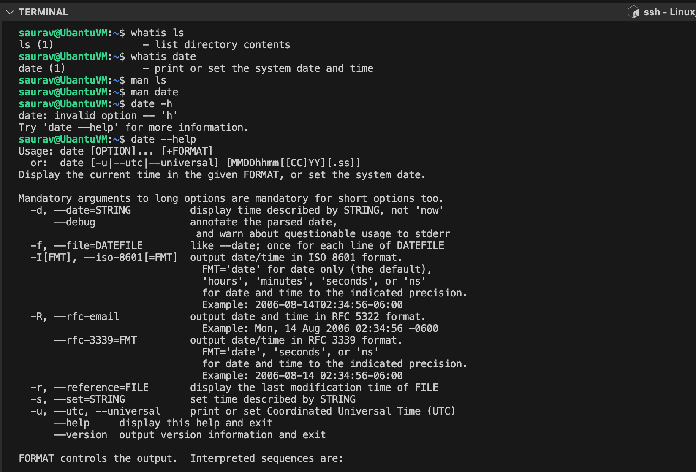
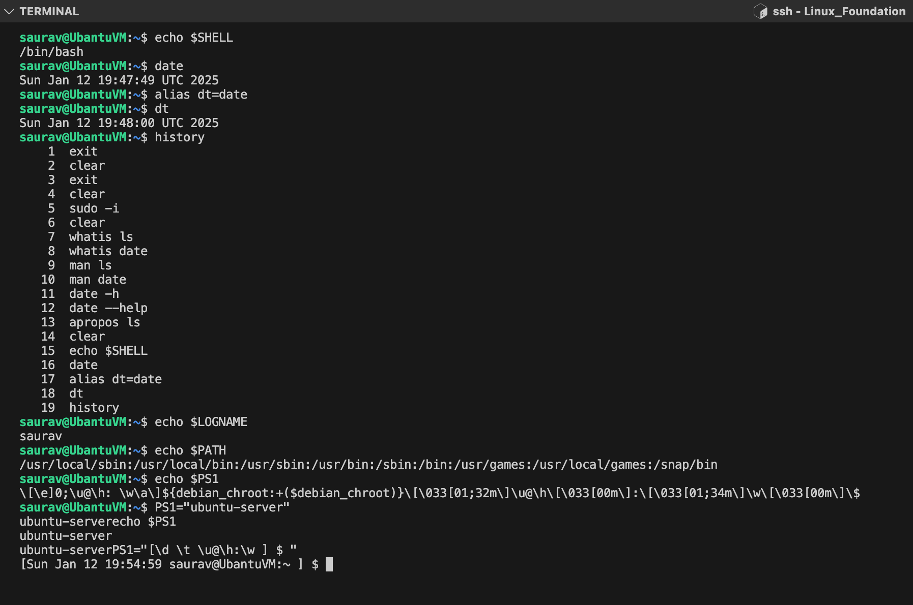
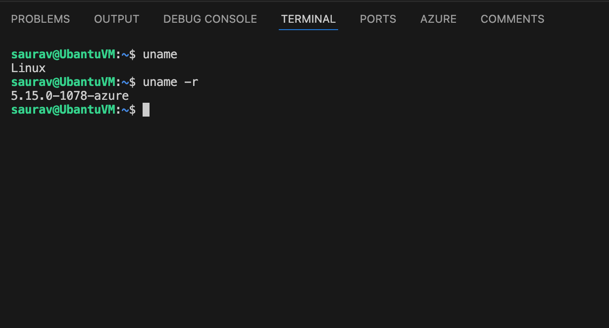

# Linux Foundation
I am talking about Liunx foundation and will add my learning summary in this repo. 

## Working with Shell:

### Shell Fundamental: 

#### Linux shell
- This command line interface (CLI) will enable you to effectively work on linux laptop/server/virtual machine.
- While the graphical version may see more appealing to the users but can be limited in case of functionality. These is where the Linux command line commonly known as **`Linux Shell`** comes to help.

#### What is a shell?

  - Linux shell is a program that allows text based interaction between the user and the operating system, this interaction is carried out by typing commands into the interface and receving the response in the same way.
  - The Linux shell is a powerful tool with which you can navigate between different locations within the system, however when you login to the shell the very first directory you were take into is your home directory.

#### Why do we need a home directoy?
  - The home directory allows users to store their personal data in the form of files and directories
  - Each user in the system gets their own unique home directory with complete access to it (to be able to save, retreive , delete data).
  - Think of it as a dedicated locker assign to you in which you can store or retreive items.
  - Other users can't access your files and folders with in your home directory **`(only you can)`.**

#### Command Prompt
- You can configure the command prompt to show whatever you want, such as the **`hostname`** , **`date`** or **`time`**. 
- It is currently configured to show the current working directory. The **`~` symbol**  here represents the home directory



#### Command and Arguments

- To interact with the linux system using the shell, a user has to type in commands
- When a command is run it executes a program to achieve a specific task.
  - **`For example`**: The **`echo`** command is used to print a line of text on the screen.
  ```
                          $ echo 
  ```
- An argument acts as an input to command
  - **`For example`**: To print a **`hello`** message type **`echo hello`** command.
  ```
                          $ echo hello
  ```
- There are several commands that can work without an argument too.
  - **`For example`**: Type in the command called **`uptime`**, this is used to print information about how long a system has been running for since the last reboot along with the other information (This command doesn't need an argument)
  ```
                          $ uptime 
  ```
- A command can also have options that modify its behaviour in some predetermine way. The option also sometime referred to as a switch or a flag 
  - **`For example`**: To print a same word `hello` but without a trailing line, use **`echo`** command with **`-n`** flag.
  ```
                          $ echo -n hello
  ```
  


#### Command Types

Command types in linux can be generally categorized in two types
 1. Internal or Built-in Commands 
    - Internal commands are part of the shell itself. It come bundled with it, there are in total about 30 such commands
    - **`For example`**: echo, cd, pwd, set e.t.c.
 2. External Commands
    - External commands on the other hand are binary programs or scripts which are usually located in distinct files in the system. They either come with pre-install with the distribution package manager or can be created or installed by the user
    - **`For Example`**: mv, date, uptime, cp e.t.c.
    
To determine a command is internal or external, use **`type`** command
 


### Basic Linux Commands

To print the present working directory. Run **`pwd`** command
```
$ pwd
```

To see the contents of the directory. Run **`ls`** command
```
$ ls 
````

To make (or) create a directory. Run **`mkdir`** command
```
$ mkdir Asia
```

To make (or) create multiple directories. Run **`mkdir`** command followed by **`<directory_name1> <directory_name2> .. <directory_nameN>`**
```
$ mkdir Europe Africa America
```

To change a directory from the current directory. Run **`cd <directory_name>`**
```
$ cd Asia
```

To recursively created directories. Run **`mkdir -p <directory_name1>/<sub_directory_of_name1>`**
```
$ mkdir -p India/Mumbai
```

To go back to one directory up. Run **`cd ..`**
```
$ cd ..
```

To go back directly to a home directory of the current user from any location in the system. Run **`cd`**
```
$ cd
```
#### Difference absolute path and relative path

- **Absolute Path** : An absolute path is defined as specifying the location of a file or directory from the root directory(/).
- **Relative Path** : Relative path is defined as the path related to the present working directly(pwd).

To change to a directory with absolute path. Run **`cd <directory_path>`**
```
$ cd /home/saurav
```

To Change to a directory with relative path. Run **`cd <directoryName>`**
```
$ cd Asia
```

To get the long list of files and directories. Run **`ls -l`** command
```
$ ls -l
```

To list all files including the hidden. Run **`ls -a`** command
```
$ ls -a
```

To list all the files in the order they were modified. Run **`ls -lt`** command
```
$ ls -lt
```

To list all the files form oldest to newest. Run **`ls -ltr`** command
```
$ ls -ltr
```


### Using command line to get help

First command is **`whatis`** , this command will displays a one line description of a command does. 

**`Syntax: whatis <command>`**

```
$ whatis date
```

Most of the commands internal or external come bundled with **`man pages`** which provides information about the command in detail (with examples, usecases and with command options)

**`Syntax: man <command>`**

```
$ man date
```

Several commands will provide **`-h`** or **`--help`** to provide users with the options and usecases available in a command

```
$ date -h
$ date --help
```

To search through the man page names and descriptions for instances of the keyword use **`apropos`**. This is useful if you want to look for all commands within the system that contains the specifc keyword.

**`Syntax: apropos <keyword>`**
```
$ apropos modpr
```


### Bash Shell

#### Different types of Shells

- There are different types of shells in linux, some of the popular ones are below
  - Bourne Shell (sh)
  - C Shell (csh or tsh)
  - Korn Shell (ksh)
  - Z Shell (zsh)
  - Bourne again shell (Bash)

To check the shell being used. Use the command **`echo $SHELL`**
```
$ echo $SHELL
```

To change the default shell. Use the command chsh, you will be prompted for the password and following that input the name of the new shell. You have to login into new terminal session to see this change though.
```
$ chsh
```

#### Bash Shell Features

1. Bash supports command auto-completion. What this means is bash means to auto-complete commands for you if you type part of it and press the **`tab`** key.
2. In Bash we can set custom aliases for the actual commands
   ```
   $ date
   $ alias dt=date
   $ dt
   ```
3. Use the **`history`** command to list the previous run commands that you ran earlier
   ```
   $ history
   ```

#### Bash environment variables
 
 To print **`SHELL`** environment variable
 ```
 $ echo $SHELL
 ```
 
 To see a list of all environment variables. Run **`env`** from the terminal
 ```
 $ env
 ```
 
 To set an environment variable with in the shell. The value is not carry forward to any other process.
 ```
 $ OFFICE=Bangalore
 ```
 
 To set an environment variable we can use the **`export`** command. To make the value carry forward to any other process. 
 ```
 $ export OFFICE=Bangalore
 ```
 
 To persistently set an environment variable over subsequent login or a reboot add them to the **`~/.profile`** or **`~/.pam_environment`** in the users home directory.
 
 ```
 $ echo "export OFFICE=Bangalore" >> ~/.profile (or)
 $ echo "export OFFICE=Bangalore" >> ~/.pam_environment
 ```
 
 To check the value of a environment variable called **`LOGNAME`**
 ```
 $ echo $LOGNAME
 ```

#### Path Variable

##### Speaking about the environment variables, when a user issues an external command into the shell, the shell uses path variable to search for these external commands
 
To see the directories defined in path variable. Use the command **`echo $PATH`**.
```
$ echo $PATH
```

To check if the location of the command can be identified. Use the **`which`** command

**`Syntax: which <command>`**

```
$ which obs-studio
```

To define a command in the **`PATH`** variable. To add we can use the **`export`** command.
```
$ export PATH=$PATH:/opt/obs/bin
$ which obs-studio
```

#### customize Bash Prompt

To see the value assign to **`PS1`**, type **`echo $PS1`**
```
$ echo $PS1
```

To change the PS1 to only display the word **`ubuntu-server`**.
```
$ PS1="ubuntu-server"
$ echo $PS1
```

#### To customize further, have a look at the below special character.

To change the bash prompt to display **`date`**, **`time`**, **`username of the current 
user`**, the **`hostname`** and the **`current working directory`**

```
$ PS1="[\d \t \u@\h:\w ] $ "
```




## Linux Core Concept

### Linux Kernel

#### If you have worked with any operating system, you have run into the term kernel. 

- The Linux kernel is monolithic, this means that the kernel carrries out CPU scheduling, memory management and several operations by itselfs. 
- The Linux Kernel is also modular, which means it can extends its capabilities through the use of dynamically loaded kernel modules

#### To understand a kernel in simple terms, let us use an analogy of a **`College Library`**. Here the librarian is equal to Linux Kernel.

#### The Kernel is responsible for 4 major tasks

1. Memory Management
1. Process Management
1. Device Drivers
1. System calls and Security

#### Linux Kernel Versions

##### let us know identify the ways to identify linux kernel versions

Use **`uname`** command to get the information about the kernel (by itself it doesn't provide much information except that the system uses the **`Linux`** Kernel.
```
$ uname
```

Use the **`uname -r`** or **`uname`** comamnd and option to print the kernel version
```
$ uname -r
$ uname -a
```



#### Kernel and User Space

##### One of the important functions of the linux kernel is the **`Memory Management`** . We will now see how memory is seperated within the linux kernel

Memory is divded into two areas.
1. Kernel Space
   1. Kernel Code
   1. kernel Extensions
   1. Device Drivers
1. User Space
   1. C
   1. Java
   1. Python
   1. Ruby e.t.c
   1. Docker Containers

#### Let us know see how programs running in the `User Space` work

All user programs function by manipulating data that is stored in memory and on disk. User programs get access to data by making special request to the kernel called **`System Calls`**
- Examples include, allocating memory by using variables or opening a file.

### Working with Hardware

Lets take an example of **`USB Disk`** be used in the system.
- As soon as the **`USB device`** is attached to the system a corresponding device driver which is part of the kernel space detects the stage change and generates an event. 
- This event which is called **`uevents`** is then sent to the **`User Space`** device manager daemon called **`udev`**. 
- The **`udev`** service is then responsible for dynamically creating a device node associated with the newly attached USB drive in the **`/dev/`** filesystem. 
- Once the process is complete, the newly attached disk should be visible under **`/dev/`** filesystem.

Use **`dmesg`** display messages from the area of kernel called **`Ring Buffer`** . When a linux operating system boots up there were numerous messages generated by the kernel that appear on the display screen. These messages also contain logs from the hardware devices that the kernel detects and provide good indication wheather it is able to configure
```
$ dmesg
$ dmesg | grep -i usb
```

The **`udevadm`** is the management utility for udev which queries the database for device information.
```
$ udevadm info --query=path --name=/dev/sda5
```

The **`udevadm monitor`** listens to the kernel new **`uevents`** upon detecting an event, it prints the details such as the **`device path`** and the **`device name`** on the screen. This command is handy to determine the details of the newly attached or removed device.
```
$ udevadm monitor
```

To list all PCI (Peripheral Component Interconnect) devices that are configured in the system. Examples of PCI devices are **`Ethernet Cards`**, **`RAID Controllers`**, **`Video Cards`** and **`wireless Adaptors`** that directly attached to PCI slots in the motherboard of the computer
```
$ lspci
```

To list information about **`Block Devices`**
```
$ lsblk
```

To display detail information about the **`CPU`** such as CPU architecture, cpu op-modes (32 bit, 64 bit) etc.
```
$ lscpu
```

To list available memory in the system. 
```
$ lsmem --summary
```

Another alternate command to see the information about the memory. This command will list total used and free memory.
```
$ free -m
```

To extract detail information about the entire hardware information of the machine
```
$ lshw
```

#### To run commands with root privileges. Not every user can run all the commands in the linux system some commands need to be run as the `root` or the `super-user`. Use **`sudo`** followed by <command> ( input the sudo password ).

```
$ sudo lshw
```

### Linux Boot Sequence

- The boot process can be broken down into four stages
  1. BIOS POST
  1. Boot Loader (GRUB2)
  1. Kernel Initialization
  1. INIT Process

#### How to initiate a linux boot process?
  - This can be achieved in one of the two ways.
    - The first method is to start a linux device which is in a halted or stopped state 
    - Second method is to reboot or reset a running system
    
 #### BIOS POST
 - The first stage, called **`BIOS POST`** has very little to do with linux itself.
 - **`POST`** Stands for **`Power On Self Test`**.
 - In this stage, BIOS runs a POST test, to ensure the hardware components that are attached to the device are functioning correctly, if POST fails the computer may not be operable and the system will not be proceed to next stage of the boot process.

 #### Boot Loader
 - The next stage after BIOS POST is **`Boot Loader`** after successful of POST test.
 - BIOS loads and executes the boot code from the boot device, which is located in the first sector of the harddisk. In Linux this is located in the **`/boot`** file system.
 - The boot loader will provide the user with the boot screen, often with multiple options to boot into. Such as Microsoft windows O.S or Ubuntu 18.04 O.S in an example of a dual boot system.
 - Once the selection is made at the boot screen, boot laoder loads the kernel into the memory supplies it with some parameters and handsover the control to kernel
 - A popular example of the boot loader is **`GRUB2`** (GRand Unified Bootloader Version 2). Its a primary boot loader now for most of the operating system.

#### Kernel Initialization
 - After the selected kerenl is selected and loads into the memory, it usually decompress and then loads kernel into the memory.
 - At this stage, kernel carries out tasks such as initializing hardware and memory management tasks among other things.
 - Once it is completely operational , kernel looks for **`INIT Process`** to run. Which sets up the **`User Space`** and the process is needed for the environment.

 #### INIT Process
 - In most of the current day linux distribution, the **`INIT`** function then calls the **`systemd`** daemon.
 - The **`systemd`** is responsible for bringing the linux host to usable state.
 - **`systemd`** is responsible for mounting the file systems, starting and managing system services.
 - **`systemd`** is the universal standard these days, but not too long ago another initialization process called **`system V (five) init`** was used. It is also called **`Sys5`
   - For example these were used in **`RHEL 6`** or **`CentOS 6`** distribution
 - Once of the key advantages of using **`systemd`** over **`system V(five) init`**  is that it reduces the system startup time by parallelizing the startup of services.
 
 To check the **`init`** system used run **`ls -l /sbin/init`**, if it is systemd then you will see a pointer to **`/lib/systemd/systemd`**
 ```
 $ ls -l /sbin/init
 ```

### Run Levels

#### Systemd Targets (Run Levels)

We can setup the server to boot either into graphical mode or non-graphical mode. Linux can run in multiple modes and these modes are set by something called **`runlevel`**
- The operation mode which provide a graphical interface is called **`runlevel 5`**
- The operation mode which provide a non-graphical mode is called **`runlevel 3`**

To see the operation mode run in the system. Run the command **`runlevel`** from the terminal
```
$ runlevel
```

During boot, the **`init`** process checks the **`runlevel`**, it make sure that all programs need to get the system operation in that mode are started.
  - For example: The **`Graphical User`** mode requires a **`display manager`** service to run for the GUI to work, however this service is not required for the **`non-graphical mode`**

In the boot process section, we saw that the **`systemd`** is used as the **`init`** process in most new linux distributions suchs as **`Ubuntu 18.04`**.
- In **`systemd`**, runlevels are called as **`targets`**.
  - The RunLevel 5 is called as the **`graphical target`** 
  - The Runlevel 3 is called as the **`multiuser target`**

#### Now that we are familiar with runlevels in systemd target unit. Lets now take a look at how we change these values from a shell.

To see the default target, run the command **`systemctl get-default`**. This command looks at the file located at **`/etc/systemd/system/default.target`** 
```
$ systemctl get-default
```

To change the default target, we can make use of **`systemctl set-target <desired target name goes here as an argument>`**
```
$ systemctl set-default multi-user.target 
```

### Filesystem Hierarchy

In this section, lets take a look at the **`filesystem hierarchy`**
- Linux uses  single rooted, inverted tree like file system
  - **`/home`**  : It is the location that contains the home directories for all users, except the **`root`** user (root user home directory is located at **`/root`**)
  - **`/opt`**   : If you want to install any third party programs put them in the **`/opt`** filesystem.
  - **`/mnt`**   : It is the default mount point for any partition and it is empty by default. It is used to mount filesystems temporarly in the system
  - **`/tmp`**   : It is used to store temporary data
  - **`/media`** : All external media is mounted on **`/media`**
  - **`/dev`**   : Contains the special block and character device files
  - **`/bin`**   : The basic programs such as binaries **`cp`**, **`mv`**, **`mkdir`** are located in the **`/bin`** directory
  - **`/etc`**   : It stores most of the configuration files in Linux.
  - **`/lib`**   : The directory **`/lib`** and **`/lib64`** is the place to look for shared libraries to be imported into your program
  - **`/usr`**   : In older systems, **`/usr`** directory is used for **`User Home Directories`**, however in the modern linux operating systems it is the location where all user land applciations in their data reside
  - **`/var`**   : It contains variable data like mails, log files
      
 To print all the mounted filesystems, run **`df`** (disk filesystem) command
 ```
 $ df -hP
 ```

## Package Management

### Package Management Distribution

In this section, we will take a look at the Linux Package Management tools used in different linux distribution
- Will start with introduction to the package management.

#### Introduction to Package Managers

For **`Debain/Ubuntu`**, it is **`apt/dpkg`** and for CentOs/Redhat, it is **`RPM`**

**Question** : What is the difference between **`CentOS`**, **`RHEL`** and **`Ubuntu`***?
- There are hundreds of Linux distributions in use today

One of the common ways to catagorize linux distribution is by the package manager it uses.
- For example: Distributions such as **`RHEL`**, **`Fedora`** and **`CentOS`**. are based on RPM. Hence they are known as **`RPM`** based distribution. The **`Debian`** family including **`Ubuntu`**, **`Debian`** and **`Linux Mint`** e.t.c. make use of **`Debian`** based package managers such as the **`DPKG`**. 

#### What is a package?
- A package in its simplest defination is a compressed archieve that contains all the files that are required by a particular software to run.
- For example: Lets consider an Ubuntu System, we want to install a simple editing system such as **`gimp`** which stands for **` GNU Image Manipulation System`**. To do this, we can make use of the **`gimp.deb`** package which contains all the software binaries and files needed to for the image editor to run along with the metadata which provides the information about the software itself.

#### Thats seems to be a quite easy process, why don't we do all the time? download a package and install it on a linux servers. Wondering the need of package managers?
- There are hundreds of linux distributions are there, these distributions runs different sets of tools and libraries, software and possibly even different linux kernels as a result of this a linux program may not run the same way from one system to another. To fix this problem packages include a manifest of dependencies or list of programs in versions that must be satified for the package software to run correctly on a given computer.

#### A package manager is a software in a linux system that provides the consistent and automated process in installing, upgrading, configuring and removing packages from the operating system.

### RPM and YUM Package Managers

In this section, we will take a look at **`RPM`** and **`YUM`** package managers in detail.
- RPM
- YUM

#### RPM (Redhat Package Manager)

This package manager is used in RHEL as well as other linux distributions but these are the most common ones. The File extensions for packages manage by RPM is **`.RPM`**

#### Working with RPM

RPM has five basic modes of operations. Each of these modes can be run using **`rpm`** command followed by a specific command **`options`**. Despite of this, RPM doesn't resolve dependencies on its own. This is why we make use of a higher level of package manager called **`YUM`**.
1. Installing
1. Uninstalling
1. Upgrade
1. Query
1. Verfiying

#### YUM (Yellowdog Updater Modifier)

YUM is a free and opensource package manager.
- Works on RPM based Linux systems
- Works with Software repositories which are essentially a collection of packages and provides package independency management on RPM based distro. The repository information is stored in **`/etc/yum.repos.d/`** and repository files will have the **`.repo`** extension.
- Acts as a high level package manager but under the hood it still depeneds on **`RPM`** to manage packages on the linux systems.
- Unlike RPM, YUM handles package dependencies very well (Automatic Dependency Resolution). It is able to install any dependencies packages to get the base package install on the linux system.

#### Now, lets take a look at sequence of steps envolve while installing the package.
- Once yum runs **`yum install`** command is issued YUM first runs transaction check, if the package is not installed in the system yum checks the configured repositories under **`/etc/yum.repos.d/`** for the availability of the requested package. 
- It also checks if there are any dependent packages are already installed in the system or if it needs to be upgrade.
- After this step, transaction summary is displayed on the screen for the user to review, if we wish to proceed with the install enter the **`y`** button (this step can be skipped by providing the **`-y`** flag with the **`yum install`** command).
- Yum will download and install necessary RPMs to linux system

If you want to update a single package, use **`yum update`** command. If the package is already in the latest version in the repository and hence no action will be taken

#### Common Commands

To list all the repos added to your system. Run **`yum repolist`**
```
$ yum repolist
```

To check which package should be installed for specific command to work. Use **`yum provides`** command followed by <command> name.
```
$ yum provides scp
```

To Install a package
```
$ yum install httpd
```

To Install a package to automatically answer "yes" to any question prompt during the operation. Use **`-y`** flag with the **`yum install`** command.
```
$ yum install httpd -y
```

To remove a package
```
$ yum remove httpd
```

To update a package
```
$ yum update telnet
```

To update all packages in the system, use the **`yum update`** command without any arguments.
```
$ yum update
```